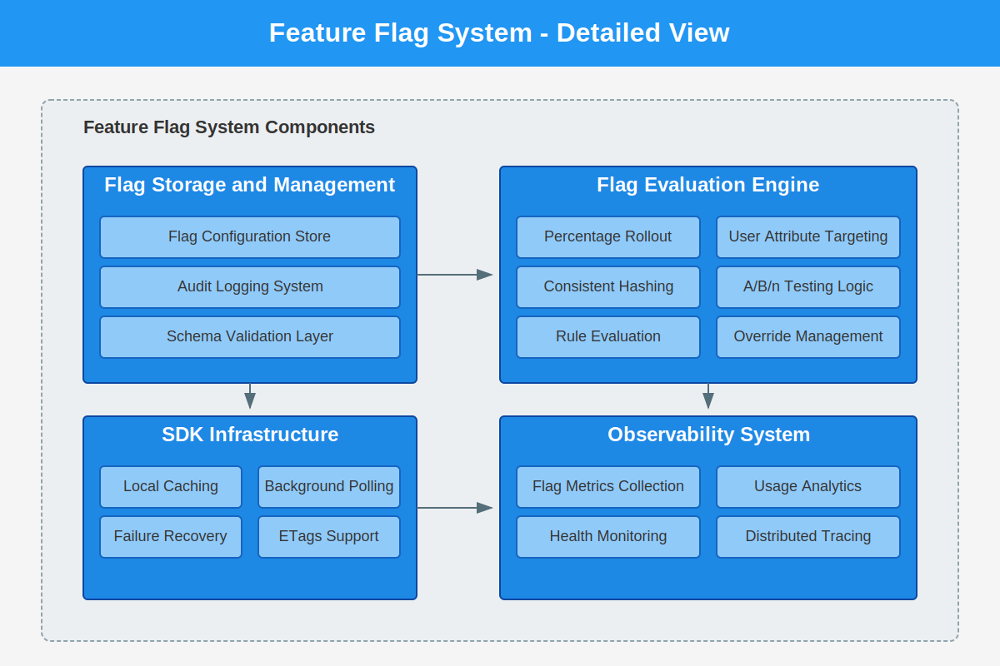
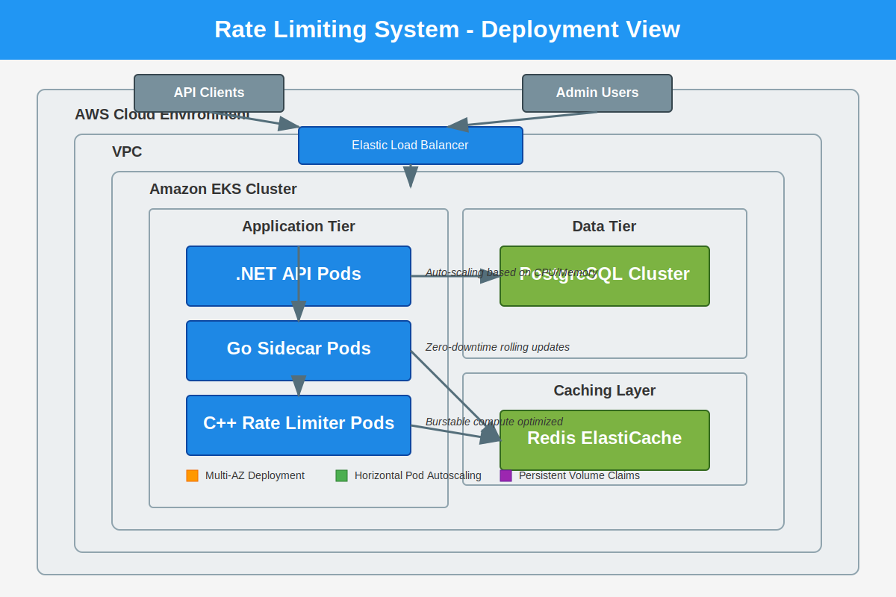
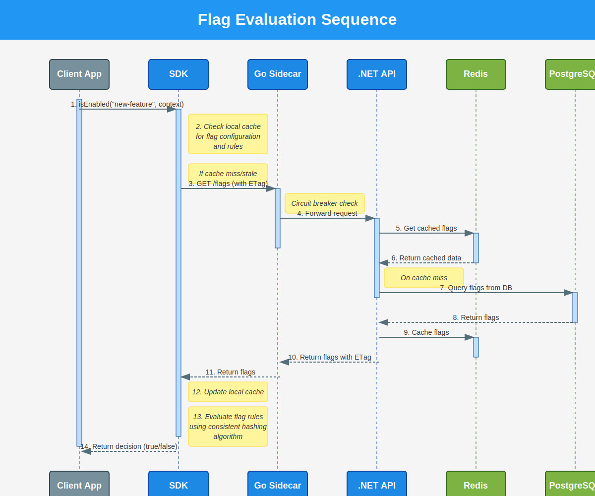

# Architecture Documentation

This directory contains detailed architecture diagrams for the Edge Control Platform.

## Overview

The Edge Control Platform uses a polyglot microservices architecture optimized for performance, resilience, and scalability. Each component is implemented using the most appropriate technology for its specific requirements.

## Diagram Types

### 1. Main Architecture Diagram

This high-level diagram shows the core components of the Edge Control Platform and their relationships.

### 2. Feature Flag Components

A detailed breakdown of the feature flag system components, showing how the evaluation engine, storage, and SDK infrastructure work together.

### 3. Deployment View

This diagram illustrates how the Edge Control Platform is deployed in a cloud environment, specifically AWS with Kubernetes.

### 4. Sequence Diagram

A detailed sequence diagram showing the flow of a feature flag evaluation request through the system.

## Key Architectural Patterns

### Polyglot Implementation

The Edge Control Platform uses multiple programming languages, each chosen for its strengths:

- **.NET 8**: For the core API, offering a good balance of performance and developer productivity
- **C++20**: For the rate limiter, where ultra-low latency and high throughput are critical
- **Go**: For the sidecar proxy, leveraging Go's excellent concurrency model and resilience patterns
- **TypeScript/React**: For the web admin UI, providing a modern and responsive user experience

### Resilience Patterns

- **Circuit Breaker**: Implemented in the Go sidecar to prevent cascading failures
- **Distributed Caching**: Using Redis with proper cache invalidation strategies
- **Consistent Hashing**: Ensuring stable user experiences during percentage-based rollouts
- **Graceful Degradation**: Fallback mechanisms when components are unavailable

### High Performance

- **Token Bucket Algorithm**: Optimized C++ implementation for rate limiting
- **Connection Pooling**: For database and Redis connections
- **ETags**: Minimizing network traffic for flag configuration updates
- **Background Processing**: Asynchronous operations to maintain responsiveness

### Scalability

- **Stateless Services**: Core components are stateless for horizontal scaling
- **Redis Cluster**: Distributed caching for flag configurations
- **PostgreSQL Scaling**: Read replicas for high-read workloads
- **Kubernetes Deployments**: Horizontal Pod Autoscaling based on CPU and memory metrics

## PlantUML Source

The source files for these diagrams are available in this directory as `.puml` files, which can be modified and regenerated as needed.
